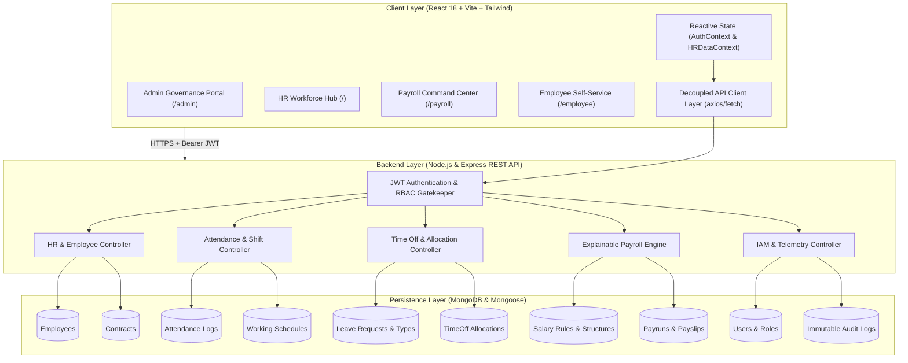
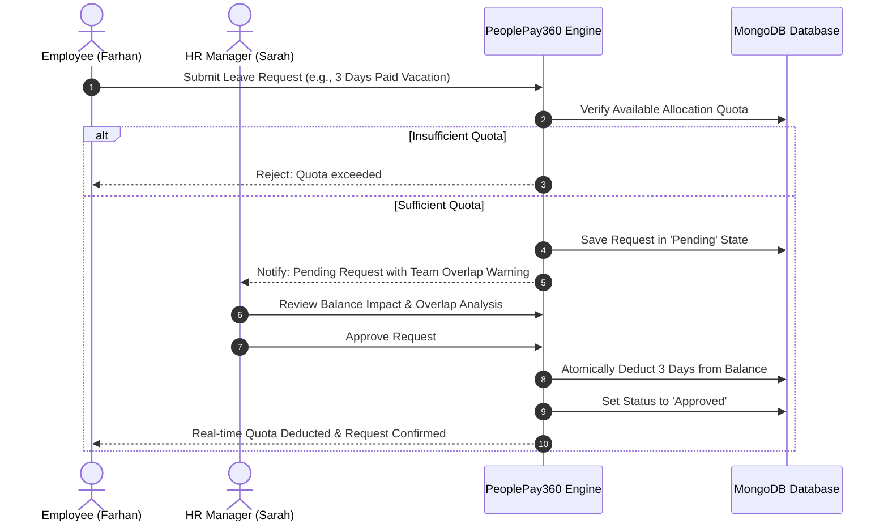
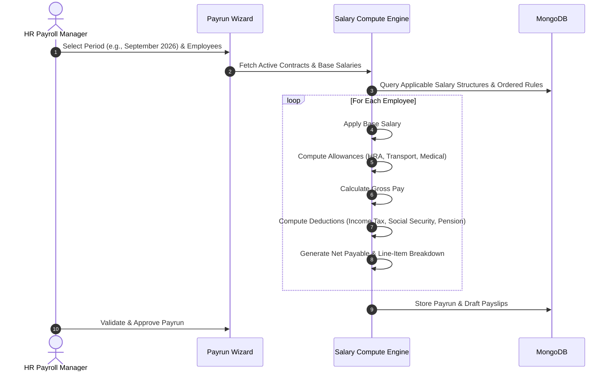

# 🌐 PeoplePay360 — Next-Gen Enterprise HR & Explainable Payroll Operating System

<div align="center">

[](https://opensource.org/licenses/MIT)
[](https://nodejs.org/)
[](https://react.dev/)
[](https://tailwindcss.com/)
[](https://www.mongodb.com/)
[]()

**A unified, role-governed workforce management platform featuring an explainable, deterministic payroll computation engine, shift pattern scheduling, audited attendance gating, and real-time quota-deducting leave administration.**

[🚀 2-Minute Judge Fast-Track](#-judge-fast-track--demo-credentials) • [✨ Key Innovations](#-key-innovations--hackathon-highlights) • [🏗️ System Architecture](#%EF%B8%8F-system-architecture--data-flow) • [📦 Quickstart Guide](#-quickstart--local-setup) • [🛡️ Multi-Persona RBAC](#%EF%B8%8F-role-based-access-control-rbac-matrix)

</div>

---

## 📌 Executive Summary & The Problem

Modern enterprises suffer from **fragmented workforce silos**. Disjointed HR and payroll platforms lead to:
1. **The "Black Box" Payroll Problem**: Payroll calculations are opaque, error-prone, and hardcoded in brittle spreadsheets, leading to compliance failures and payroll disputes.
2. **Attendance Discrepancies**: Missing attendance logs, unverified punch-ins, and untracked manual corrections create payroll discrepancies.
3. **Leave Overlaps & Quota Leakage**: Time-off approvals happen without real-time balance checks or department-wide overlap awareness, leaving shifts understaffed.
4. **Security Vulnerabilities**: Lack of true role-based access control (RBAC) allows unauthorized access to sensitive salary data.

### 💡 The PeoplePay360 Solution
**PeoplePay360** bridges workforce operations and payroll finance into a single, cohesive ecosystem. By placing the **Employee as the central operational hub**, every contract, shift pattern, attendance register, and leave approval flows automatically into a **transparent, rule-driven payroll computation engine**.

---

## 🎯 Judge Fast-Track & Demo Credentials

To experience the full power of PeoplePay360, test our **5 distinct enterprise personas**. Each role boots directly into a custom-tailored command center with strict access boundaries:

| Persona | Email | Password | Primary Command Center | Core Scope |
| :--- | :--- | :--- | :--- | :--- |
| 🛡️ **System Admin** | `admin@peoplepay360.com` | `Admin123!` | `/admin` | IAM, Role Reassignments, Audit Logs, System Health |
| 👔 **HR Manager** | `hr.manager@peoplepay360.com` | `Password123!` | `/` | Workforce Snapshot, Contracts, Shifts, Leave Approvals |
| 💼 **HR Payroll Manager** | `sarah.jenkins@peoplepay360.internal` | `Password123!` | `/` & `/payroll` | Full HR authority + Salary Structures, Formulas & Payruns |
| 🧮 **HR Payroll User** | `elena.rostova@peoplepay360.internal` | `Password123!` | `/payroll` | Compute Payruns, Inspect Payslips, Batch Exports |
| 👤 **Employee (Tech)** | `farhan@gmail.com` | `Employee123!` | `/employee` | Self-Service Portal: Clock-in Gate, Profile, Leave Requests |
| 👤 **Employee (Design)** | `akshat@gmail.com` | `Employee123!` | `/employee` | Self-Service Portal: Real-time Quota Deductions |

> [!TIP]
> **2-Minute Demo Evaluation Walkthrough**:
> 1. **Login as Admin** (`admin@peoplepay360.com`): Explore `/admin` to inspect system telemetry and user governance. Click `/admin/roles` to review the interactive 12×5 Permission Matrix.
> 2. **Login as HR Manager** (`hr.manager@peoplepay360.com`): Navigate to `/employees` → click **Marcus Vance** to view the 360° Employee Hub. Visit `/time-off` to review and approve a leave request with real-time balance calculations.
> 3. **Login as HR Payroll Manager** (`sarah.jenkins@peoplepay360.internal`): Go to `/payroll` → launch the **New Payrun Wizard** → compute monthly salaries with explainable line-item salary rules.
> 4. **Login as Employee** (`farhan@gmail.com`): View `/employee` → test the **Today Attendance Clock-in Gate** and submit a vacation request with real-time balance preview.

---

## ✨ Key Innovations & Hackathon Highlights

### 1. 🧮 Deterministic, Explainable Payroll Computation Engine
- **Formula-Driven Salary Rules**: Computes earnings, statutory deductions, pension contributions, and net pay dynamically based on sequence, type (`percentage` vs `fixed`), and inputs.
- **Auditable Line-Item Breakdown**: Every payslip preserves an exact, itemized computation log—no opaque numbers.
- **Payrun State Machine**: Enforces strict operational lifecycle transitions: `Draft` ➔ `Computing` ➔ `Computed` ➔ `Validated` ➔ `Approved` ➔ `Paid`.

### 2. 🌐 Employee 360° Operational Anchor
- Rather than isolated database records, the employee profile acts as an operational hub connecting:
  - **Contracts**: Active terms vs historical agreements with automated conflict prevention (blocking overlapping active contracts).
  - **Working Schedules**: Mathematical calculation of weekly standard hours minus meal breaks.
  - **Live Attendance**: Clock-in registers, shift exceptions, and audited HR adjustments.
  - **Time Off Quotas**: Multi-tier allocations (Annual, Sick, Personal, Maternity).

### 3. ⏱️ Intelligent Attendance Gateway & Shift Patterns
- Strict shift window validation that flags late check-ins, early check-outs, and overtime.
- HR manual adjustment drawer with mandatory audit comments and author tracking.

### 4. 🏖️ Audited Leave Workflow & Overlap Detection
- **Impact Preview**: Side-by-side comparison of *Current Balance*, *Requested Days*, and *Projected Balance*.
- **Team Overlap Intelligence**: Warns reviewers if colleagues in the same department are already scheduled off during the requested window.
- **Atomic Balance Consumption**: Quota deductions apply synchronously upon approval; refusals log mandatory justifications without affecting balances.

### 5. 🔒 Multi-Persona RBAC & System Governance
- **Zero Button-Hiding Security**: Complete separation of operational boundaries verified by server-side JWT authentication and route middleware.
- **Immutable Audit Trail (`/admin/audit`)**: Real-time logging of user provisioning, role promotions, and configuration changes with JSON export capability.
- **Subsystem Telemetry**: Real-time health monitoring for HR, Attendance, Time Off, and Payroll services.

---

## 🏗️ System Architecture & Data Flow



---

## 🛡️ Role-Based Access Control (RBAC) Matrix

PeoplePay360 enforces an enterprise capability model across 12 distinct platform modules:

| Module | Employee | HR Manager | HR Payroll User | HR Payroll Manager | System Admin |
| :--- | :---: | :---: | :---: | :---: | :---: |
| **Personal Profile & Attendance** | `R / U` | `R` | `R` | `R` | `R` |
| **Workforce Directory** | `—` | `C / R / U / D` | `R` | `C / R / U / D` | `C / R / U / D` |
| **Contracts Management** | `—` | `C / R / U` | `R` | `C / R / U` | `C / R / U / D` |
| **Working Schedules** | `—` | `C / R / U` | `R` | `C / R / U` | `C / R / U / D` |
| **Attendance Exceptions & Audit** | `—` | `C / R / U` | `R` | `C / R / U` | `C / R / U / D` |
| **Leave Approval & Quotas** | Self `C / R` | `C / R / U` | `R` | `C / R / U` | `C / R / U / D` |
| **Salary Rules & Structures** | `—` | `—` | `R` | `C / R / U` | `C / R / U / D` |
| **Payrun Computation & Payslips** | Self `R` | `—` | `C / R` | `C / R / U / Valid` | `Full Admin` |
| **User Identity & Access (IAM)** | `—` | `—` | `—` | `—` | `C / R / U / D` |
| **Role Promotions & Governance** | `—` | `—` | `—` | `—` | `Full Control` |
| **Immutable Audit Logs** | `—` | `—` | `—` | `—` | `R / Export` |
| **System Diagnostics & Telemetry** | `—` | `—` | `—` | `—` | `Full Monitor` |

*Legend: `C` = Create, `R` = Read, `U` = Update, `D` = Delete, `Valid` = Validate/Authorize*

---

## 🔄 Core Business Workflows

### 1. Leave Request & Allocation Lifecycle


### 2. Payrun Generation & Salary Rule Execution


---

## 💻 Tech Stack & Architecture Highlights

### Frontend
- **Framework**: [React 18](https://react.dev/) + [Vite](https://vitejs.dev/) for lightning-fast HMR and bundle efficiency.
- **Styling**: [Tailwind CSS](https://tailwindcss.com/) with a curated enterprise palette, responsive drawers, modal dialogs, and smooth micro-interactions.
- **Icons**: [Lucide React](https://lucide.dev/) for consistent, accessible iconography.
- **Routing**: [React Router 6](https://reactrouter.com/) with strict protected route guards (`RequireAuth`).
- **State Architecture**: Reactive multi-context architecture (`AuthContext`, `HRDataContext`, `EmployeeDataContext`) backed by a decoupled service layer.

### Backend
- **Runtime**: [Node.js](https://nodejs.org/) (v18+) with [Express](https://expressjs.com/).
- **Database**: [MongoDB](https://www.mongodb.com/) via [Mongoose 8](https://mongoosejs.com/) with strict schema validations and relational indexes.
- **Security**: Stateless JSON Web Tokens (JWT), salted SHA-256 / bcrypt password hashing, and role-enforced route middleware.
- **API Spec**: Clean RESTful architecture with automated CORS origin governance and unified error handling.

---

## 📂 Project Structure

```
people_pay/
├── README.md                            # Comprehensive Hackathon Master Documentation
├── FRONTEND_ARCHITECTURE.md             # Detailed Admin UI & RBAC Architecture
├── TIME_OFF_UI.md                       # Deep-dive Leave Administration Specification
│
├── backend/                             # Express REST API Server
│   ├── config/
│   │   └── db.js                        # MongoDB Mongoose connection
│   ├── constants/
│   │   └── roles.js                     # 5 Enterprise Role definitions
│   ├── controllers/                     # Core Business Logic Handlers
│   │   ├── adminController.js           # IAM, roles, audit logs, system telemetry
│   │   ├── authController.js            # User authentication & token generation
│   │   ├── employeeController.js        # Workforce CRUD & profile hub
│   │   ├── attendanceController.js      # Check-in gates & audit adjustments
│   │   ├── contractController.js        # Employment terms & conflict prevention
│   │   ├── payrollController.js         # Payrun processing & payslip generation
│   │   └── timeOffRequestController.js  # Overlap checks & quota balance deductions
│   ├── middleware/
│   │   └── auth.js                      # JWT token verification & role enforcement
│   ├── models/                          # 13 Mongoose Domain Models
│   │   ├── User.js, Employee.js, Contract.js, WorkingSchedule.js
│   │   ├── Attendance.js, TimeOffRequest.js, TimeOffAllocation.js
│   │   ├── SalaryStructure.js, SalaryRule.js, Payrun.js, Payslip.js
│   │   └── AuditLog.js
│   ├── routes/                          # REST API Endpoints (/api/auth, /api/hr, /api/payroll, /api/admin)
│   ├── scripts/                         # Seeding & Verification Test Suites
│   │   ├── seedFullData.js              # One-command enterprise mock database seeder
│   │   ├── smoke-all-roles.js           # Automated end-to-end multi-role test suite
│   │   └── test-calendar-validation.js  # Leave calendar & attendance verification
│   ├── server.js                        # Express server entry point
│   ├── package.json
│   └── .env.example
│
└── frontend/                            # React 18 Single Page Application
    ├── index.html                       # HTML5 entry with Inter font
    ├── vite.config.js                   # Vite configuration
    ├── tailwind.config.js               # Theme tokens & custom utility styling
    ├── src/
    │   ├── App.jsx                      # Route layout, providers & role boundaries
    │   ├── components/
    │   │   ├── admin/                   # UserFormModal, RoleChangeDialog, UserDetailDrawer
    │   │   ├── attendance/              # AttendanceCheckInGateModal, AttendanceCorrectionModal
    │   │   ├── contracts/               # ContractFormModal, ContractViewModal
    │   │   ├── employee/                # RequestTimeOffModal, TodayAttendanceCard, LeaveBalanceSection
    │   │   ├── employees/               # EmployeeListView, EmployeeKanbanView, EmployeeFormModal
    │   │   ├── layout/                  # AppShell, EmployeeShell, Sidebar, TopBar, GlobalSearchModal
    │   │   ├── payroll/                 # NewPayrunWizardModal, PayrunListView, PayslipDetailDrawer
    │   │   ├── schedules/               # ScheduleEditorModal
    │   │   ├── timeoff/                 # HRLeaveRequestModal, TimeOffCalendarView, TimeOffReviewModal
    │   │   └── ui/                      # Modal, Drawer, DataTable, StatCard, Badge, Toast
    │   ├── context/                     # AuthContext, HRDataContext, EmployeeDataContext
    │   ├── pages/                       # Modular view controllers
    │   │   ├── Admin/                   # Overview, Users, Roles & Permissions, System, Audit Logs
    │   │   ├── Dashboard/               # Workforce KPI overview
    │   │   ├── Employee/                # Employee Dashboard, Profile, Attendance, Time-Off
    │   │   ├── Employees/               # Workforce Directory & Employee 360° Profile
    │   │   ├── Payroll/                 # Payrun Processing, Payslips, Salary Rules & Structures
    │   │   └── TimeOff/                 # Calendar, Requests, Balances & Types
    │   └── services/                    # Clean, decoupled API client calls
    ├── package.json
    └── .env.example
```

---

## 🚀 Quickstart & Local Setup

Get the full application running locally in under **3 minutes**:

### Prerequisites
- [Node.js](https://nodejs.org/) (v18.0.0 or higher)
- [MongoDB](https://www.mongodb.com/try/download/community) (Local instance on `mongodb://127.0.0.1:27017` or MongoDB Atlas URI)
- npm or yarn

---

### Step 1: Clone the Repository
```bash
git clone https://github.com/AMMANMALEK/PeoplePay360-HR-Payroll.git
cd PeoplePay360-HR-Payroll
```

---

### Step 2: Configure & Launch Backend

```bash
# 1. Navigate to backend directory
cd backend

# 2. Install dependencies
npm install

# 3. Configure environment variables
# Copy .env.example to .env (defaults to localhost:5000 and local MongoDB)
cp .env.example .env

# 4. Seed the Database with Complete Hackathon Enterprise Data
# (Seeds users, employees, schedules, contracts, attendance, time-off allocations, rules, and payruns)
node scripts/seedFullData.js

# 5. Start the backend server
npm run dev
# Backend running at: http://localhost:5000
```

---

### Step 3: Configure & Launch Frontend

Open a new terminal window:

```bash
# 1. Navigate to frontend directory
cd frontend

# 2. Install dependencies
npm install

# 3. Configure environment variables (optional, defaults to http://localhost:5000)
# VITE_API_BASE_URL=http://localhost:5000/api
cp .env.example .env

# 4. Start the frontend development server
npm run dev
# Frontend running at: http://localhost:3000
```

---

### Step 4: Run Automated Verification (Smoke Test)

Validate backend endpoints, role permissions, and token authorization across all 5 roles:

```bash
cd backend
node scripts/smoke-all-roles.js
```
*Expected output: All test suites return `✅ SUCCESS`.*

---

## 📡 API Reference Overview

The backend exposes a clean, standardized RESTful API:

| Prefix | Scope | Key Endpoints | Auth Required |
| :--- | :--- | :--- | :---: |
| `/api/auth` | Authentication | `POST /login`, `POST /logout`, `GET /me` | No |
| `/api/me` | Self-Service | `GET /profile`, `POST /attendance/clock-in`, `POST /attendance/clock-out`, `GET /time-off`, `POST /time-off/request` | Yes (Employee) |
| `/api/hr` | Workforce Ops | `/employees`, `/attendance`, `/contracts`, `/schedules`, `/time-off` | Yes (HR / Admin) |
| `/api/payroll` | Payroll Engine | `/payruns`, `/payruns/:id/compute`, `/payslips`, `/salary-structures`, `/salary-rules` | Yes (Payroll / Admin) |
| `/api/admin` | Governance & IAM | `/users`, `/roles`, `/audit-logs`, `/telemetry`, `/departments` | Yes (Admin) |

> [!NOTE]
> A ready-to-import Postman Collection is included in [`backend/postman/PeoplePay360-Employee-CRUD.postman_collection.json`](backend/postman/PeoplePay360-Employee-CRUD.postman_collection.json).

---

## 🔮 Future Roadmap

- [ ] **Multi-Currency Global Payroll**: Dynamic FX conversions and cross-border statutory compliance.
- [ ] **Automated Tax Filing**: Webhook integrations for automated tax forms generation (W-2, Form 16, P60).
- [ ] **AI Shift Optimization**: Machine learning recommendation engine to auto-balance employee shift rosters against historical peak workload.
- [ ] **Biometric Hardware Integration**: Webhook receivers for ZKTeco and Hikvision hardware attendance clocks.

---

## 👥 Contributors & Hackathon Team

Crafted with ❤️ for the Hackathon by the **PeoplePay360 Team**:
- **Farhan Shaikh** — Lead Full-Stack Architect
- **Amman Malek** — Frontend & UI/UX Specialist
- **Sarhan Vohra** — Backend & Payroll Computation Systems

---

## 📄 License

This project is licensed under the **MIT License** — see the [LICENSE](LICENSE) file for details.
