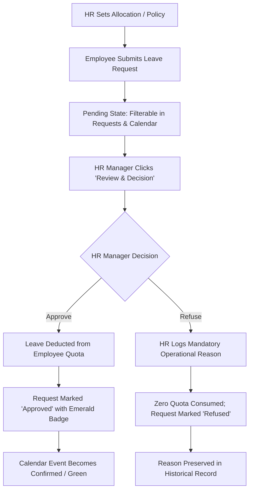

# PeoplePay360 Time Off Module — Architecture & Operational Documentation

## 1. Time Off Module Purpose

The **PeoplePay360 Time Off module** provides an end-to-end, enterprise-grade leave administration workspace for HR Managers, Team Leads, and Platform Administrators. Rather than treating time-off records as isolated CRUD rows in a database, PeoplePay360 enforces a unified business lifecycle:

$$\text{Leave Policy / Allocation} \longrightarrow \text{Employee Request} \longrightarrow \text{HR Review \& Overlap Analysis} \longrightarrow \text{Decision (Approve / Refuse)} \longrightarrow \text{Live Balance Consumption} \longrightarrow \text{Team Calendar \& Historical Status}$$

---

## 2. End-to-End Business Workflow



1. **Policy Allocation**: Employees are assigned statutory or discretionary annual quotas (e.g. 18 days Annual Leave, 10 days Paid Sick Leave).
2. **Employee Request Submission**: A leave request is filed with date ranges, calculated working days, and a justification.
3. **Managerial Review Drawer**: The HR Manager opens the request slide-over drawer to inspect:
   - Requested dates and calculated working duration (excluding weekends).
   - Employee's stated reason.
   - **LEAVE BALANCE IMPACT**: Live comparison of *Current Balance*, *Requested (-X days)*, and *After Approval*.
   - **TEAM CONTEXT**: Automated overlap detection highlighting whether other colleagues in the same department are already scheduled off during that period.
4. **Approve / Refuse Decision**:
   - **Approval**: Consumes the quota immediately, updates remaining balance, transitions request to `Approved`, and displays a success toast.
   - **Refusal**: Prompts for a mandatory operational justification, leaves the balance completely intact, transitions request to `Refused`, and logs the decision reason.

---

## 3. Data Flow & State Management

### 3.1 Architecture Overview

```
Mock Data Layer (mockData.js)  <-- Fallback if Mongo API empty
           ↓
Service Layer (timeOffService.js)
           ↓
React Context (HRDataContext.jsx)
           ↓
Page & Subcomponents (TimeOffPage, TimeOffReviewModal, TimeOffCalendarView, TimeOffRequestModal)
```

- **Service Layer (`timeOffService.js`)**: Encapsulates all REST calls (`apiClient.get/post/put`). If backend collections are currently unseeded or offline, it transparently uses the in-memory store so that the app remains fully functional without simulated network errors.
- **Context Layer (`HRDataContext.jsx`)**:
  - `timeOffRequests`: Live list of all employee requests.
  - `allocations`: Live balance quota records.
  - `timeOffTypes`: Configurable time-off types.
  - `approveTimeOff(requestId)`: Atomically updates request status and recalculates allocation balances.
  - `refuseTimeOff(requestId, reason)`: Records refusal reason and changes status without touching balances.
  - `addTimeOffRequest(form, employee)`: Creates a new pending request.
  - `addTimeOffType(data)`: Configures a new leave category.

---

## 4. Tab Experiences

### 4.1 Requests Tab (Primary Operational Workspace)
- **Status Summary Cards**: Interactive cards (`PENDING`, `APPROVED`, `REJECTED`) dynamically derived from state. Clicking any card filters the request list immediately to that status.
- **Filter Bar**: Dynamic search across employee name, ID, and leave type, alongside Department, Status, and Leave Type dropdowns.
- **Active Filter Chips**: Interactive removable chips displaying all active criteria (e.g. `Status: Pending ×`, `Department: Engineering ×`) with a `Reset all` trigger.
- **Action Buttons**:
  - `[ Review & Decision ]` (Primary Indigo) on Pending items.
  - `[ View Detail ]` (Secondary Outline) on Approved/Refused items.

### 4.2 Calendar Tab (Team Time-Off Schedule)
- **Monthly View Grid**: Defaults to September 2026 with previous/next month controls and a quick `[ Today ]` button.
- **Event Chips**: Shows daily employee off-days color-coded according to PeoplePay360 semantics:
  - `Emerald`: Approved leave
  - `Amber`: Pending requests
  - `Rose`: Refused decisions
- **Interactive**: Clicking any event chip opens the comprehensive `Review & Decision` drawer.
- **Department Filtering**: Quick dropdown to isolate calendar view to a single department (e.g., Engineering, Product, HR).

### 4.3 Allocations Tab (Employee Quotas)
- Displays table tracking `Allocated`, `Used`, and prominent `Remaining` days.
- Includes a proportional progress bar showing percentage of quota consumed (color-transitioning from indigo to amber/rose as limits approach exhaustion).
- Search and Department filters for fast HR lookups.

### 4.4 Types Tab (Leave Configuration)
- Cards displaying each configurable type: `Annual Leave`, `Sick Leave`, `Parental Leave`, `Unpaid Sabbatical`, `Bereavement Leave`.
- Displays allocation requirement, default limits, paid/unpaid status pill, and active request count.
- Includes `+ Add Time Off Type` drawer.

---

## 5. Hackathon Demo Script (Explain to Judge)

> **"Time Off in PeoplePay360 is engineered around the actual HR decision lifecycle.**
>
> In many generic HR applications, leave requests are merely records in a database table. In PeoplePay360:
>
> 1. The manager starts at the **Time Off workspace** and immediately sees real status counts: **11 Pending, 7 Approved, 2 Rejected**.
> 2. Clicking the **Pending card** automatically filters the view to requests awaiting decision.
> 3. Opening **David Kim's** request for September 22→26 brings up the **Review Drawer**:
>    - The system displays his **Current Balance: 14 days**.
>    - It calculates the requested duration: **-5 days**.
>    - It projects his **After Approval balance: 9 days**.
>    - Under **Team Context**, it alerts the HR Manager if other Engineering colleagues are already scheduled off during that same week.
> 4. Upon clicking **Approve Request**:
>    - The status immediately switches to **Approved**.
>    - David's leave balance in the Allocations tab is updated.
>    - The **Team Calendar** switches his event chip to confirmed emerald.
>
> All of this happens seamlessly within the established PeoplePay360 design system, reusing shared buttons, drawers, badges, and typography."

---

## 6. Verification & Quality Assurance

- **Zero Breaking Changes**: Shared styles (`DataTable`, `PageHeader`, `Drawer`, `StatusBadge`, `FilterBar`) are preserved without altering other modules (Employees, Attendance, Contracts, Schedules, Payroll, Reports).
- **Zero Raw Technical Errors**: Graceful state fallbacks prevent blank pages or unhandled promise rejections.
- **Accessibility**: Statuses use semantic badges pairing icons with text indicators (e.g. `✓ Approved`, `! Pending`, `× Refused`), avoiding reliance on color alone.
